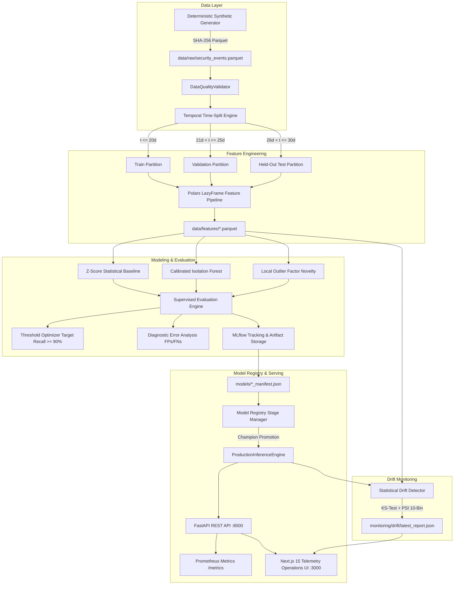

# AnomalyLab Architecture & Engineering Design

This document details the production engineering architecture, offline/online separation, thread safety, and data flow of **AnomalyLab**.

---

## 1. High-Level Architecture Overview

---

## 2. ML System Invariants & Guarantees

1. **Temporal Disjointness (Invariant 1)**:
   - Datasets are partitioned along absolute time boundaries: $\max(T_{\text{train}}) \le \min(T_{\text{val}}) \le \max(T_{\text{val}}) \le \min(T_{\text{test}})$.
   - Prevents lookahead data leakage inherent in random cross-validation on time-series telemetry.

2. **Causal Rolling Windows (Invariant 2)**:
   - All temporal aggregation features ($5\text{m}$, $1\text{h}$, $24\text{h}$) strictly compute sliding summaries over historical events $t \le T$.
   - Verified by unit tests asserting that appending future events induces $0.000$ variance in historical event features.

3. **Strict Target Label Exclusion (Invariant 3)**:
   - The ground-truth columns (`is_anomaly`, `anomaly_type`) and entity primary identifiers (`user_id`, `host_id`, `source_ip`) are stripped prior to model ingestion.

4. **Training-Serving Feature Parity**:
   - Both online streaming endpoints and batch training leverage the identical `FeatureContract (security_features_v1)` with deterministic log transformations and categorical mappings.

---

## 3. Production Serving & Thread Safety

- **Lifespan Warm-up**: On ASGI initialization, the champion model artifact (`.joblib`) and manifest (`.json`) are loaded into memory and primed with 10 synthetic inference passes to warm the CPU vector cache.
- **Thread Pool Delegation**: Model scoring (`IsolationForest.score_samples`) is executed within a dedicated `concurrent.futures.ThreadPoolExecutor` to avoid blocking FastAPI's async event loop.
- **Zero-Downtime Hot Reload**: Stage promotion via `/api/v1/models/{version}/promote` swaps the in-memory reference to the active production model atomically.

---

## 4. Observability & Telemetry

- **Prometheus Counters & Histograms**:
  - `anomalylab_predictions_total`: Partitioned by `model_version` and `risk_band`.
  - `anomalylab_anomalies_total`: Number of confirmed positive flags.
  - `anomalylab_prediction_latency_seconds`: Multi-bucket latency histogram.
- **Structured Middleware**: Every HTTP request receives a unique `X-Request-ID` and `X-Response-Time-Ms` response header.
